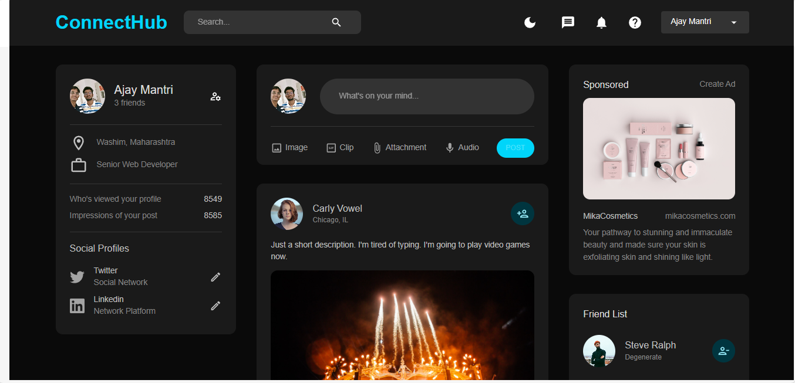
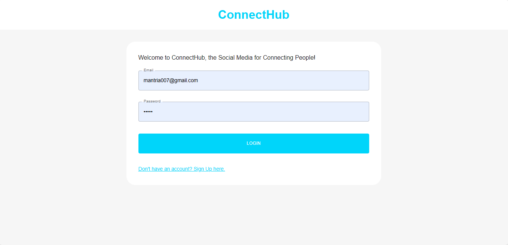
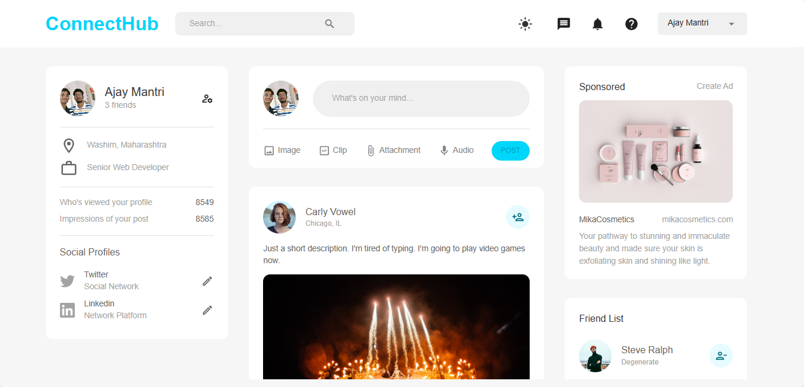

# connectHub

A full stack social media app.

## 🖥️ Tech Stack
**Frontend:**

&nbsp;
&nbsp;
&nbsp;
&nbsp;

**Backend:**

&nbsp;
&nbsp;
&nbsp;
&nbsp;

## 🚀 Features
- Login/Signup User Account
- Add/Remove friends
- Add/Delete a Post
- Like a Post
- Switch to Light/Dark mode
- View a Profile

## Sneak Peek of connectHub 🙈 :

<table>
  <tr>
    <td></td>
    <td></td>
  </tr>
</table>

## End ✌️ 😊

